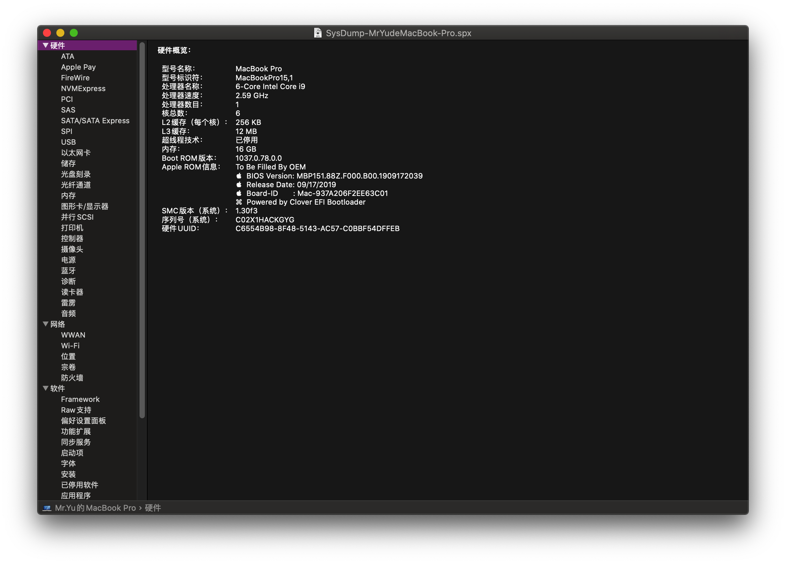
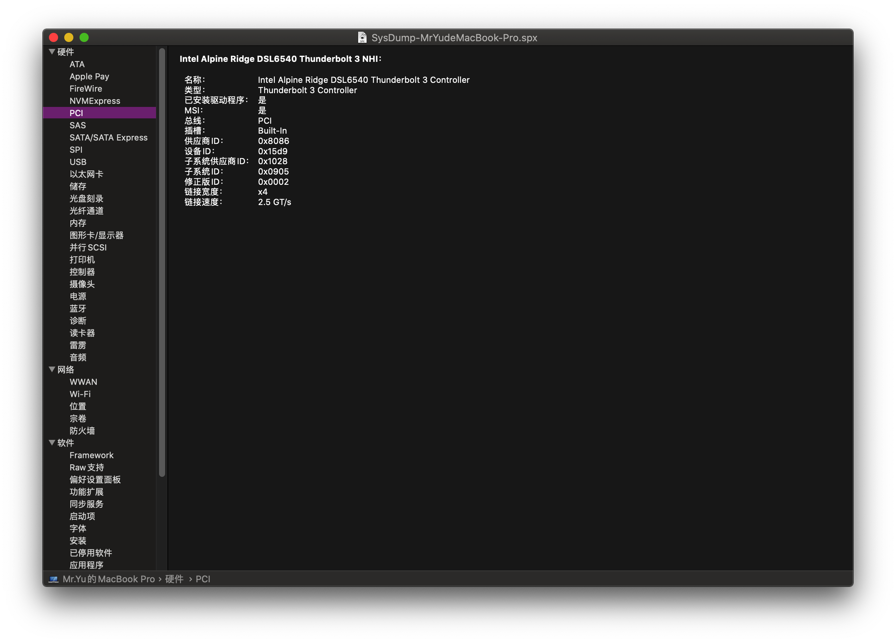
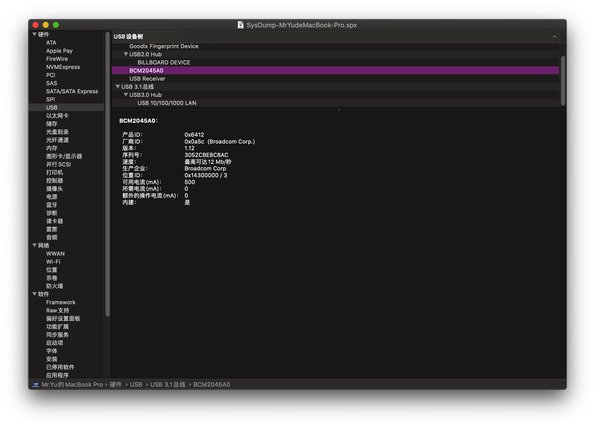
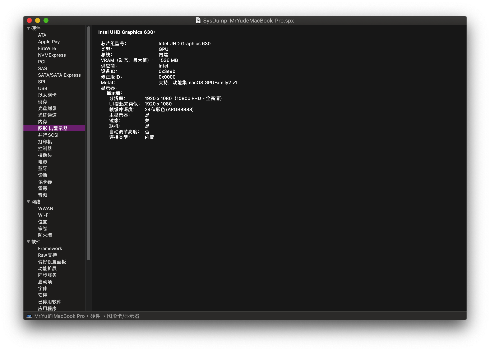
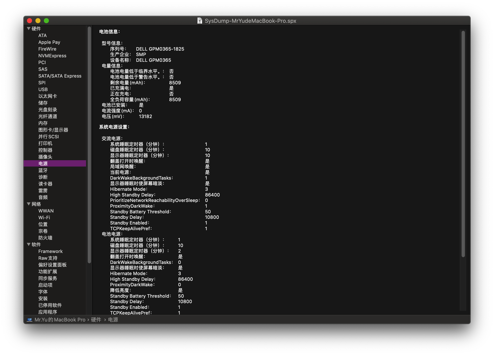
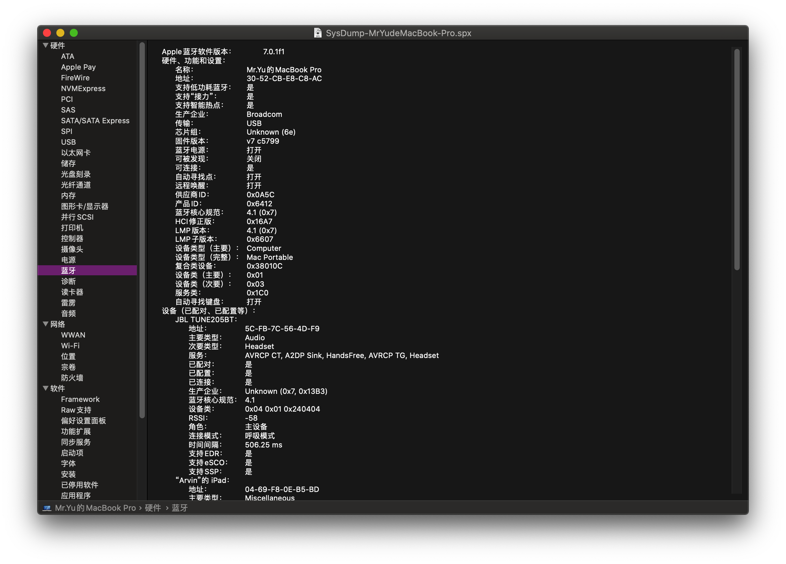
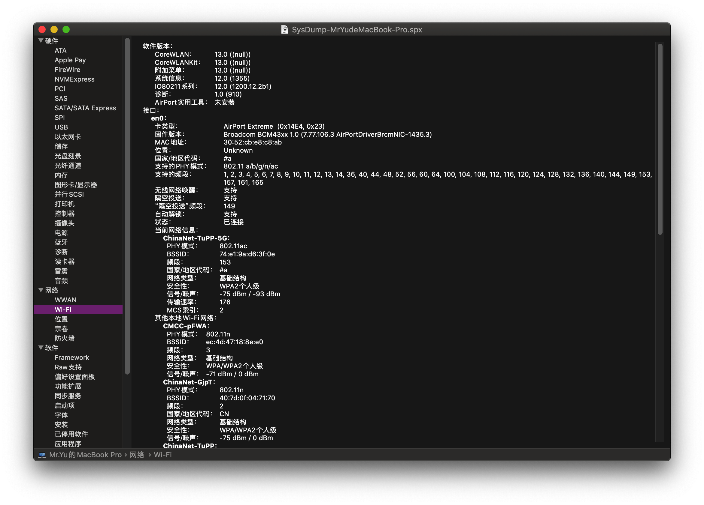

# XPS15-7590-Hackintosh

## 电脑配置

| 规格     | 详细信息                                                     |
| -------- | ------------------------------------------------------------ |
| 电脑型号 | DELL XPS 15 7590                                             |
| 操作系统 | macOS Catalina 10.15 / macOS Mojave 10.14                    |
| 处理器   | Intel(R) Core(TM) i7-9750H                                   |
| 内存     | 16GB                                                         |
| 硬盘     | KXG60ZNV1T02 NVMe TOSHIBA 1024GB                             |
| 显卡     | Intel UHD Graphics 630(0x3e9b0000)                           |
| 显示器   | 15.6" 1920x1080                                              |
| 声卡     | Realtek ALC257                                               |
| 网卡     | 更换为 [DW1820A](https://blog.daliansky.net/DW1820A_BCM94350ZAE-driver-inserts-the-correct-posture.html) |

## 截屏

